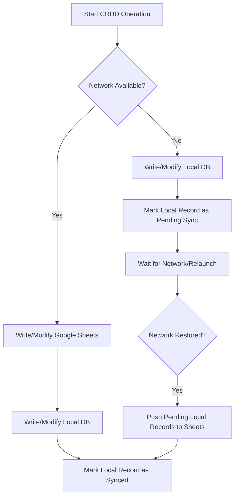

# Project Architecture Rules: Offline-First Google Sheets Sync

This document defines the guidelines and synchronization rules for managing data in this application. The project is designed with a **completely offline-first, local-oriented architecture** where a Google Sheet serves as the centralized remote database (server).

## Core Principles

1. **Offline-First (Local Database/Excel Oriented)**:
   - The application must always remain fully operational without an internet connection.
   - All CRUD operations must execute on local storage (our "local excel/database instance") immediately.
   - User transactions, staff changes, and services are saved locally first.

2. **Google Sheets as Remote Server**:
   - Google Sheets functions as the central cloud server/database.
   - Local records must eventually synchronize with Google Sheets to keep all devices and administrators up to date.

3. **Network-Aware CRUD Flow**:
   When performing any Create, Read, Update, or Delete (CRUD) operation:
   - **Step 1**: Check if network connectivity is available.
   - **Step 2**:
     - **If Online**: Write/Update the record in Google Sheets first, then write the exact same instance to the local database. Mark the record status as `Synced`.
     - **If Offline**: Write the record to the local database only. Mark the record status as `Pending Sync`.
   - **Step 3**: When connectivity returns, trigger a background synchronization routine to push all `Pending Sync` records to Google Sheets.

---

## CRUD Synchronization Workflow

### 1. Create / Update (Write Operations)
- If a user saves a new service or staff details:
  - Check connectivity (e.g. using a connectivity package or HTTP ping).
  - If **online**, send a write request to the Google Sheets API. If successful, save the data locally with `is_synced = true`.
  - If **offline**, save the data locally with `is_synced = false`. Add this transaction to a local queue.
  
### 2. Read (Query Operations)
- Always read from the local cache/database to ensure immediate UI responsiveness.
- If **online**, fetch the latest data from Google Sheets in the background to update the local database, then refresh the UI.
- If **offline**, load data directly from the local cache and notify the user that they are viewing offline data.

### 3. Background Sync (Network Recovery)
- Listen to network connectivity changes (e.g., using Flutter's `connectivity_plus` or checking socket connections).
- As soon as the network becomes available:
  - Fetch all local records marked as `Pending Sync` (`is_synced == false`).
  - Iteratively write those rows into the respective Google Sheets worksheets.
  - Update the local records' status to `Synced` (`is_synced = true`) upon successful upload.
  - Handle rate limits by introducing minor delays between batch uploads.

---

## Technical Details

- **Local Storage Options**: Use lightweight local databases such as `shared_preferences` (for settings, sessions, and simple cache lists) or `sqlite`/`hive`/`isar` (for structured datasets like services, staff details, and reports).
- **Remote Integration**: Use the `googleapis` and `googleapis_auth` package to communicate with the shared Google Spreadsheet.
- **Sync Conflict Resolution**: Google Sheets row IDs serve as the source of truth. Offline entries created locally receive temporary local IDs, which are replaced or mapped to final row numbers in Google Sheets once successfully synced.
